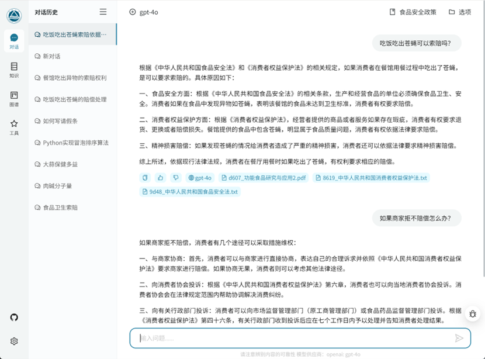
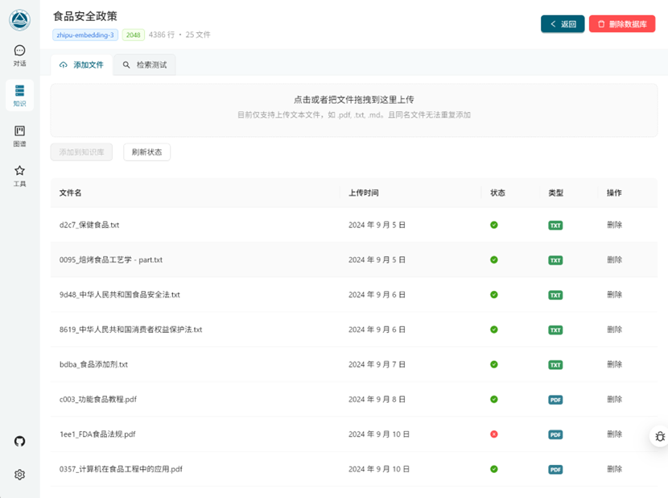
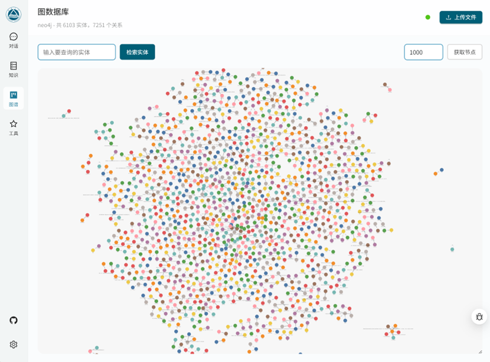
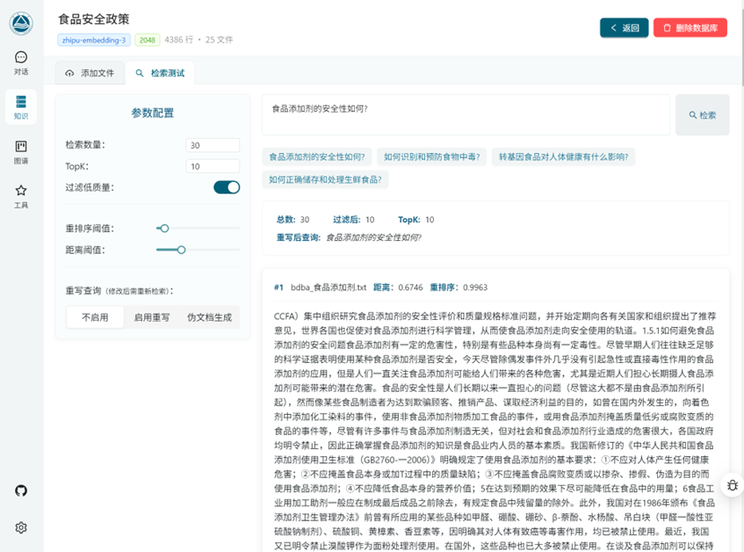

<h1 style="text-align: center">Yuxi (语析) </h1>

> [!WARNING]
> **[WIP]** 当前项目还处于开发的早期。

## 预览







## 准备

1. 提供 API 服务商的 API_KEY，并放置在 `src/.env` 文件中，参考 `src/.env.template`。默认使用的是智谱AI。需要配置 `ZHIPUAPI=<ZHIPU_KEY>`。
2. 配置 python 环境 `pip install -r requirements.txt`，python 版本应当小于 `3.12`。
3. 前端 UI 部分，需要安装 Node.js  环境，参考：[Download Node.js](https://nodejs.org/en/download/package-manager)。

**如果不启用知识库，可以仅安装下面的依赖**

```
FlagEmbedding==1.2.10
Flask==3.0.3
Flask_Cors==4.0.1
openai==1.35.10
python-dotenv==1.0.1
PyYAML==6.0.1
zhipuai
```

> [!WARNING]
> milvus-lite（向量数据库）不支持在 Windows 上运行，建议使用 WSL，详见：https://github.com/milvus-io/milvus-lite/issues/175

### 配置图数据库 neo4j (可选)

使用 docker 部署 neo4j 服务，配置文件见 [local_neo4j/docker-compose.yml](local_neo4j/docker-compose.yml).
默认账号密码见最后一行，可以使用 `http://localhost:7474/` 在浏览器可视化访问。

```bash
cd local_neo4j
docker compose up -d
```

可以使用 `python test_neo4j.py` 来测试是否正常启动。使用 `docker compose down` 可停止服务。
如果想要管理 neo4j，也可以使用 `docker ps` 查看容器 id，然后使用 `docker exec -it  <CONTAINER_ID> /bin/bash` 进入容器。
如果想要删除数据库中的文件，可以进入容器并停止 neo4j 后，执行 `rm -rf /data/databases`。

## 启动

### 1. 手动启动

```bash
# 后端部分
python -m src.api

# 前端部分
cd web
npm install  # 首次运行需要
npm run server
```

### 2. 脚本启动

注意：此脚本不会启动图数据库 neo4j。

```bash
bash run.sh
```

### 3. Docker 启动

**提醒**：此部分暂时依赖于前端打包之后的内容（后面考虑更新），同时会自动启动 neo4j 图数据库。

```bash
docker compose up --build
```

如果需要使用到本地模型，比如向量模型或者重排序模型，则需要将环境变量中设置的 `MODEL_ROOT_DIR` 做映射，比如本地模型都是存放在 `/hdd/models` 里面，则需要在 `docker-compose.yml` 中添加：

```yml
services:
  # 后端服务
  backend:
    image: pytorch/pytorch:2.4.1-cuda11.8-cudnn9-runtime  # 或者您可以自定义 Python 基础镜像
    container_name: backend
    working_dir: /app
    volumes:
      - ./src:/app/src  # 映射源代码
      - ./requirements.txt:/app/requirements.txt
      - ./saves:/app/saves
      - /hdd/models:/hdd/models  # <=== 修改这里
...
```

**提醒**：启动 docker 之后，如果需要进行调试的时候，务必先停掉 docker （在项目路径下，使用 `docker compose down`），然后再运行 `bash run.sh`，不然会出现端口冲突。这是由于没有单独设置生产环境和开发环境，这个以后再说。

## 其余脚本

镜像构建之后，单独启动后端服务

```bash
docker run -w /app -v ./src:/app/src -v ./saves:/app/saves -p 5000:5000 yuxi-know-backend
```
