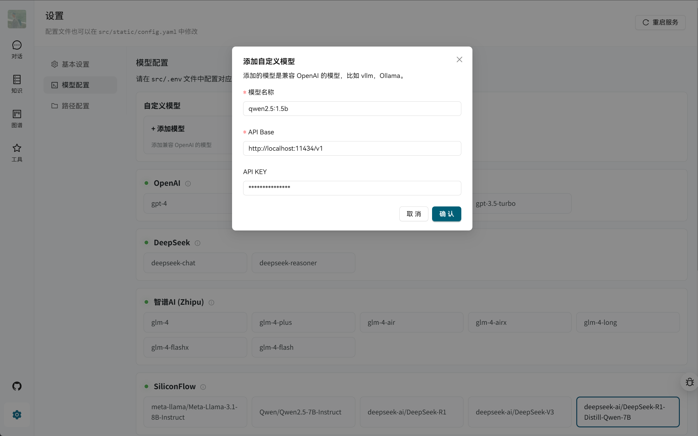

<h1 align="center">语析 - 基于大模型的知识库与知识图谱问答系统</h1>

<div align="center">


</div>

## 📖 简介

语析是一个功能强大的智能问答平台，融合了 RAG 知识库与知识图谱技术，基于 LangGraph + Vue.js + FastAPI + LightRAG 架构构建。

### ✨ 核心特性

- 🤖 **多模型支持** - 兼容 OpenAI、国内主流大模型平台及本地部署（vLLM、Ollama）
- 📚 **灵活知识库** - 支持 PDF、TXT、MD、Docx 等格式，支持 URL 导入和联网搜索
- 🤖 **智能体扩展** - 支持自定义智能体开发，兼容 LangGraph 部署
- 🕸️ **知识图谱** - 基于 Neo4j 的图谱问答，可接入现有知识图谱
- 👥 **权限控制** - 支持超级管理员、管理员、普通用户三级权限体系


https://github.com/user-attachments/assets/15f7f315-003d-4e41-a260-739c2529f824


## 🚀 快速开始

### 系统要求

项目本身不需要显卡支持，可以运行在任何设备上。对于模型推理或者文档解析服务都可以和项目本身解耦，通过环境变量配置对应的服务即可。同时项目也提供了本地部署基于 vllm 的脚本。

- Docker 和 Docker Compose
- 2GB+ 可用内存
- （可选）CUDA 支持的 GPU（用于 OCR 服务）

### 一键启动

1. **克隆项目**
   ```bash
   git clone -b stable https://github.com/xerrors/Yuxi-Know.git
   cd Yuxi-Know
   ```

2. **配置 API 密钥**

   复制环境变量模板并编辑：
   ```bash
   cp src/.env.template src/.env
   ```

   **必需配置**（推荐使用硅基流动免费服务）：
   ```env
   SILICONFLOW_API_KEY=sk-270ea********8bfa97.e3XOMd****Q1Sk
   ```
   > 💡 [免费获取 SiliconFlow API Key](https://cloud.siliconflow.cn/i/Eo5yTHGJ)（注册即送 14 元额度）

3. **启动服务**
   ```bash
   docker compose up --build
   ```

   添加 `-d` 参数可后台运行。启动完成后访问：[http://localhost:5173](http://localhost:5173)

4. **停止服务**
   ```bash
   docker compose down
   ```

### 故障排除

- **镜像拉取失败**：如果拉取镜像失败，可以尝试手动拉取：
  ```bash
  bash docker/pull_image.sh python:3.13-slim  # 替换后面的 repo_name 即可
  ```
- **内存不足**：如果 Milvus 启动失败，执行 `docker compose up milvus -d && docker restart api-dev`
- **查看日志**：`docker logs api-dev -f`


## 🤖 模型配置

### 对话模型

支持多种 API 服务商，配置对应的 `API_KEY` 即可使用：

| 服务商 | 推荐模型 | 环境变量 | 备注 |
|--------|---------|----------|------|
| 硅基流动 | `Qwen2.5-7B-Instruct` | `SILICONFLOW_API_KEY` | 🆓 免费，默认 |
| OpenAI | `gpt-4o` | `OPENAI_API_KEY` | |
| DeepSeek | `deepseek-chat` | `DEEPSEEK_API_KEY` | |
| 豆包方舟 | `doubao-pro` | `ARK_API_KEY` | |
| 智谱清言 | `glm-4-flash` | `ZHIPUAI_API_KEY` | |
| 阿里云 | `qwen-max-latest` | `DASHSCOPE_API_KEY` | |

**完整配置示例：**
```env
# 基础配置（必需）
SILICONFLOW_API_KEY=sk-your-key-here

# 可选配置
OPENAI_API_KEY=sk-your-openai-key
DEEPSEEK_API_KEY=sk-your-deepseek-key
TAVILY_API_KEY=your-tavily-key          # 联网搜索功能
```

### OpenAI 兼容模型

项目理论上兼容任何 OpenAI 兼容的模型，包括但不限于：

- vLLM
- Ollama
- 其他 API 中转或者代理服务

在 Web 界面的"设置"中添加本地模型地址。



## 📚 功能详解

### 知识库管理

- **多格式支持**：PDF、TXT、Markdown、Docx、Excel 等
- **多种导入方式**：本地上传、URL 导入、批量导入
- **智能分块**：自动优化文档分割策略
- **向量检索**：基于 Milvus 的高效相似度搜索

### 知识图谱

使用 Neo4j 构建知识图谱问答能力：

1. **数据格式**：支持 JSONL 格式导入
   ```jsonl
   {"h": "北京", "t": "中国", "r": "首都"}
   {"h": "上海", "t": "中国", "r": "直辖市"}
   ```

2. **图谱访问**：
   - Web 界面：[http://localhost:7474](http://localhost:7474)
   - 默认账户：`neo4j` / `0123456789`

3. **现有图谱接入**：修改 `docker-compose.yml` 中的 `NEO4J_URI` 配置

## 🔧 高级配置

### OCR 服务（可选）

对于基础的 OCR 服务（RapidOCR onnx 版本），可以使用 SWHL/RapidOCR 的 onnx 版本，但是需要提前将模型下载到 `$MODEL_DIR` 目录下。

```bash
huggingface-cli download SWHL/RapidOCR --local-dir ${MODEL_DIR:-./models}/SWHL/RapidOCR
```

*如果提示 `[Errno 13] Permission denied` 则需要使用 sudo 修改权限之后再执行*

提升 PDF 解析准确性，可以选择使用 MinerU 或 PP-Structure-V3 服务，但是需要 GPU 支持：

```bash
# MinerU（需要 CUDA 12.4+）
docker compose up mineru --build

# PP-Structure-V3（需要 CUDA 11.8+）
docker compose up paddlex --build
```

### 服务端口说明

| 端口 | 服务 | 说明 |
|------|------|------|
| 5173 | Web 前端 | 用户界面 |
| 5050 | API 后端 | 核心服务 |
| 7474/7687 | Neo4j | 图数据库 |
| 9000/9001 | MinIO | 对象存储 |
| 19530/9091 | Milvus | 向量数据库 |
| 30000 | MinerU | PDF 解析（可选）|
| 8080 | PaddleX | OCR 服务（可选）|
| 8081 | vLLM | 本地推理（可选）|

### 自定义模型供应商

在 [src/static/models.yaml](src/static/models.yaml) 中添加新的模型配置：

```yaml
your_provider:
  name: "自定义供应商"
  default: "your-model-name"
  base_url: "https://api.your-provider.com/v1"
  env:
    - YOUR_API_KEY
  models:
    - your-model-name
```

## ❓ 常见问题

暂无

## 🤝 参与贡献

感谢所有贡献者的支持！

<a href="https://github.com/xerrors/Yuxi-Know/contributors">
    
</a>

### 如何贡献

1. Fork 本项目
2. 创建特性分支 (`git checkout -b feature/amazing-feature`)
3. 提交更改 (`git commit -m 'Add some amazing feature'`)
4. 推送到分支 (`git push origin feature/amazing-feature`)
5. 创建 Pull Request

## 📊 Star History

[](https://star-history.com/#xerrors/Yuxi-Know)

## 📄 许可证

本项目采用 MIT 许可证 - 查看 [LICENSE](LICENSE) 文件了解详情。

---

<div align="center">

**如果这个项目对您有帮助，请不要忘记给我们一个 ⭐️**

[报告问题](https://github.com/xerrors/Yuxi-Know/issues) | [功能请求](https://github.com/xerrors/Yuxi-Know/issues) | [讨论](https://github.com/xerrors/Yuxi-Know/discussions)

</div>
