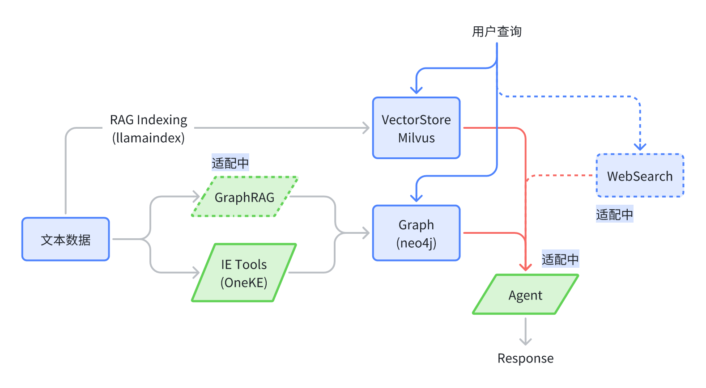

<h1 align="center">语析 （基于大模型的知识库+知识图谱问答平台）</h1>
<div align="center">


  


</div>


## 概述

基于大模型 RAG 知识库与知识图谱的问答平台。Llamaindex + VueJS + Flask + Neo4j。大模型适配 OpenAI、国内主流大模型平台的模型调用、本地 vllm 部署。只需要配置对应服务平台的 `API_KEY` 即可使用。



> [!NOTE]
> 当前项目还处于开发的早期，还存在一些 BUG，有问题随时提 issue。

代办清单

- [ ] Ollma Embedding 支持（Open-like Embedding 支持）
- [ ] 知识图谱索引支持自定义 Embedding 模型
- [x] DeepSeek-R1 支持

## 更新日志

- 2025.02.20 DeepSeek-R1 支持，需配置 `DEEPSEEK_API_KEY` 或者 `SILICONFLOW_API_KEY` 使用
- 2024.10.12 后端修改为 [FastAPI](https://github.com/fastapi)，并添加了 [Milvus-Standalone](https://github.com/milvus-io) 的独立部署。


## 快速上手

在启动之前，提供 API 服务商的 API_KEY，并放置在 `src/.env` 文件中。默认使用的是智谱AI。因此务必需要配置 `ZHIPUAI_API_KEY=<ZHIPUAI_API_KEY>`。其余模型的配置可以参考 [src/static/models.yaml](src/static/models.yaml) 中的 env。

```
ZHIPUAI_API_KEY=270ea********8bfa97.e3XOMd****Q1Sk
OPENAI_API_KEY=sk-*********[可选]
```

本项目的基础对话服务可以在不含显卡的设备上运行，大模型使用在线服务商的接口。但是如果想要完整的知识库对话体验，则需要 8G 以上的显存。因为需要本地运行 embedding 模型和 rerank 模型。如果需要指定本地模型所在路径，需要配置 `MODEL_DIR` 参数。

**提醒**：下面的脚本会启动开发版本，源代码的修改会自动更新（含前端和后端）。如果生产环境部署，请使用 `docker/docker-compose.yml` 启动。

```bash
docker compose -f docker/docker-compose.dev.yml --env-file src/.env up --build
```

**也可以加上 `-d` 参数，后台运行。*

下面的这些容器都会启动：

```bash
[+] Running 7/7
 ✔ Network docker_app-network       Created
 ✔ Container graph-dev              Started
 ✔ Container milvus-etcd-dev        Started
 ✔ Container milvus-minio-dev       Started
 ✔ Container milvus-standalone-dev  Started
 ✔ Container api-dev                Started
 ✔ Container web-dev                Started
```

然后打开 [http://localhost:5173/](http://localhost:5173/) 就可以看到结果了。

**预览**


关闭 docker 服务：

```bash
docker compose -f docker/docker-compose.dev.yml --env-file src/.env down
```

查看日志：

```bash
docker logs <CONTAINER_NAME>  # 例如：docker logs api-dev
```

**生产环境部署**：本项目同时支持使用 Docker 部署生产环境，只需要更换 `docker-compose` 文件就可以了。

```bash
docker compose -f docker/docker-compose.yml --env-file src/.env up --build
```

## 模型支持

### 1. 对话模型支持

模型仅支持通过API调用的模型，如果是需要运行本地模型，则建议使用 vllm 转成 API 服务之后使用。使用前请在 `.env` 配置 APIKEY 后使用，配置项目参考：[src/config/models.yaml](src/config/models.yaml)

| 模型供应商            | 默认模型                                  | 配置项目                                       |
| :-------------------- | :---------------------------------------- | :--------------------------------------------- |
| `openai`            | `gpt-4o`                                | `OPENAI_API_KEY`                             |
| `qianfan`（百度）   | `ernie_speed`                           | `QIANFAN_ACCESS_KEY`, `QIANFAN_SECRET_KEY` |
| `zhipu`(默认)       | `glm-4-flash` (免费)                    | `ZHIPUAI_API_KEY`                            |
| `dashscope`（阿里） | `qwen-max-latest`                       | `DASHSCOPE_API_KEY`                          |
| `deepseek`          | `deepseek-chat`                         | `DEEPSEEK_API_KEY`                           |
| `siliconflow`       | `meta-llama/Meta-Llama-3.1-8B-Instruct` | `SILICONFLOW_API_KEY`                        |

同样支持以 OpenAI 的兼容模型运行模型，可以直接在 Web 设置里面添加。比如使用 vllm 和 Ollama 运行本地模型时。

### 2. 向量模型支持

建议直接使用智谱 AI 的 embedding-3，这样不需要做任何修改，且资费不贵。

> [!Warning]
> 需要注意，由于知识库和图数据库的构建都依赖于向量模型，如果中途更改向量模型，会导致知识库不可用。此外，知识图谱的向量索引的建立默认使用 embedding-3 构建，因此检索的时候必须使用 embedding-3（现阶段还不支持修改）

| 模型名称(`config.embed_model`) | 默认路径/模型                    | 
| :------------------------------- | :------------------------------- |
| `bge-m3`            | `BAAI/bge-m3`       | 
| `zhipu`                        | `embedding-2`, `embedding-3` |

### 3. 重排序模型支持

目前仅支持 `BAAI/bge-reranker-v2-m3`。

### 4. 本地模型支持

对于**语言模型**，并不支持直接运行本地语言模型，请使用 vllm 或者 ollama 转成 API 服务之后使用。

对于**向量模型**和**重排序模型**，可以不做修改会自动下载模型，如果下载过程中出现问题，请参考 [HF-Mirror](https://hf-mirror.com/) 配置相关内容。如果想要使用本地已经下载好的模型（不建议），可以在网页的 settings 里面做映射。或者修改 `src/static/config.yaml` 来配置映射关系。但请记得，本地模型的路径要在 docker-compose 的文件中映射 volumes。


## 知识库支持

本项目支持多种格式的知识库，目前支持的格式有：pdf、txt、md。文件上传后，会首先转换为纯文本，然后使用向量模型将文本转换为向量，然后存储到向量数据库中。这个过程可能会花费不少时间。

## 知识图谱支持

> [!NOTE]
> 现阶段项目所使用的 OneKE 自动创建知识图谱的效果并不是很好，暂时移除了，建议在项目外创建知识图谱**

本项目支持 Neo4j 作为知识图谱的存储。需要将图谱整理成 jsonl 的格式，每一行都是 {"h": "北京", "t": "中国", "r": "首都"} 这样的格式，然后在网页的图谱管理里面添加这个文件。

项目启动后会自动启动 neo4j 服务，可以直接使用 [http://localhost:7474/](http://localhost:7474/) 去访问和管理图数据库，初始默认的账户密码是 `neo4j` 和 `0123456789`。可以在 `docker/docker-compose.yml` 和 `docker\docker-compose.dev.yml` 中修改（注：`api.environment` 和 `graph.environment` 都需要修改）。

目前项目中暂不支持同时查询多个知识图谱，短期内也没有计划支持。不过倒是可以通过配置不同的 `NEO4J_URI` 服务来切换知识图谱。如果已经有了基于 neo4j 的知识图谱，可以将 `docker-compose.yml` 中的 `graph` 配置项删除，并将 `api.environment` 中的 `NEO4J_URI` 配置项修改为 neo4j 的服务地址。

## 相关问题

### 镜像下载问题

如果无法直接下载相关镜像，参考 [DaoCloud/public-image-mirror](https://github.com/DaoCloud/public-image-mirror?tab=readme-ov-file#%E5%BF%AB%E9%80%9F%E5%BC%80%E5%A7%8B)，尝试将前缀替换为：

```bash
# 以 neo4j 为例，其余一样
docker pull m.daocloud.io/docker.io/library/neo4j:latest

# 然后重命名镜像
docker tag m.daocloud.io/docker.io/library/neo4j:latest neo4j:latest
```
